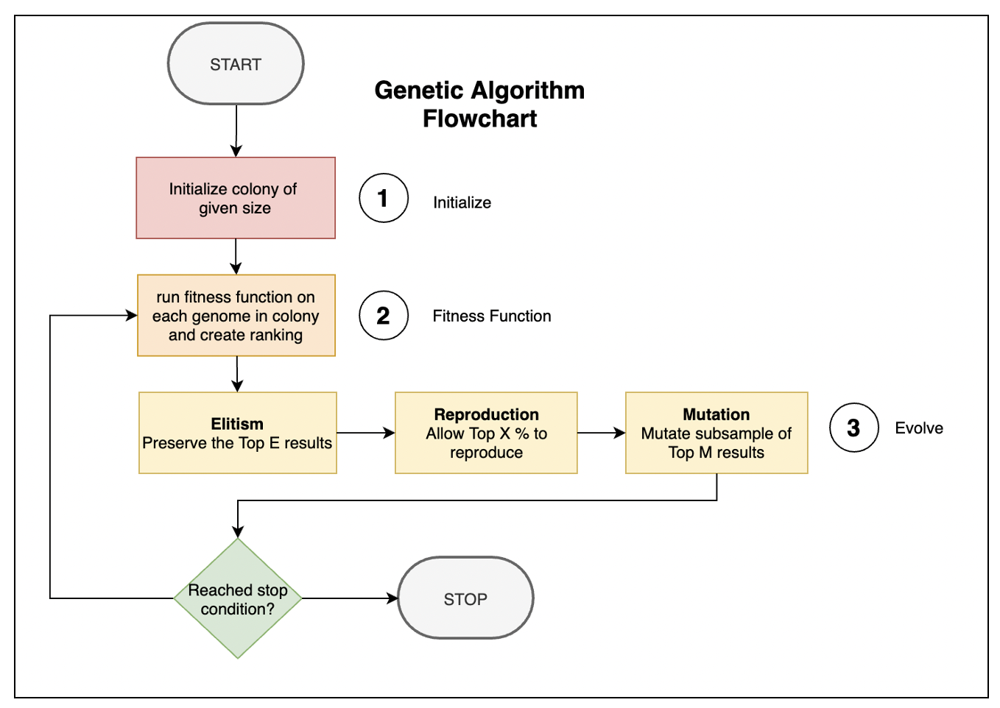
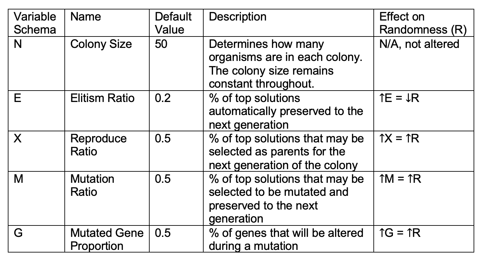
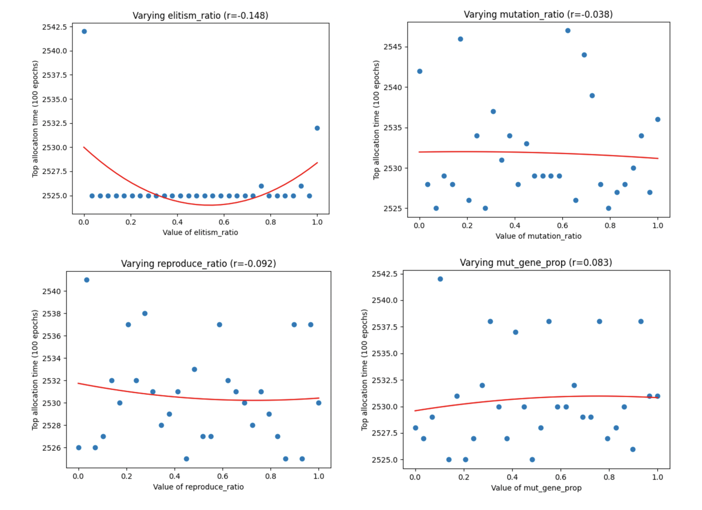
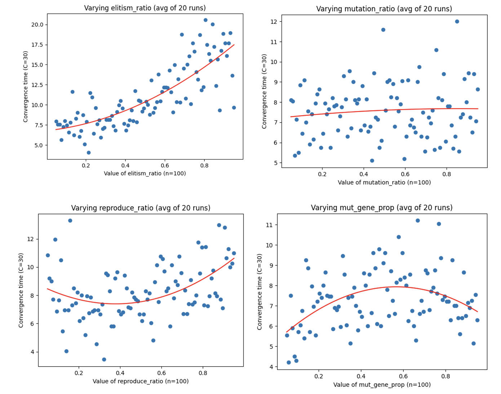

# Random Evolution in Algorithms
*How Does Varying Levels of Randomness in Genetic Algorithms Affect Outcomes?*

CS 57N/PHIL 3N Final Project

Jay Yu

## About

This project will apply a genetic algorithm to the “OS timesharing problem” introduced in Problem Set 2 Question 3, where there are two parallel processing kernels and N processes of varying completion times. 
The Operating System (OS) must find out how to allocate the processes amongst the kernels to optimize the run-time of the entire system.
The overarching algorithm is as follows:

## Methodology
Several hyperparameters that control the amount of "randomness" in the
genetic algorithm are altered and their effect on outcomes and convergence times of the algorithm are observed. They are described as follows:

## Results

### Outcomes
The outcomes are as follows on a linear dataset (note the theoretical min score is 250250). No significant linear or quadratic trends have been found.

### Convergence Times
Effect on convergence time is displayed below. Effect of randomness on each hyperparameter is unique.

